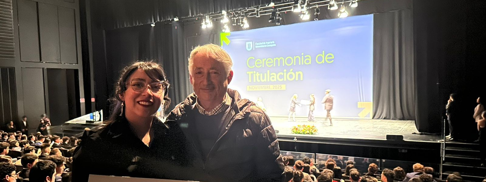
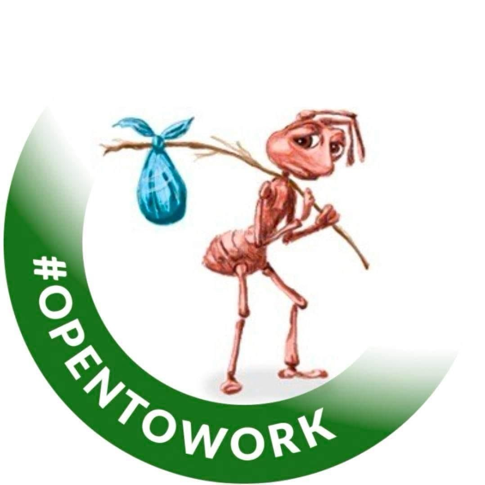

  
# Hola, soy Jocelyn Matus Ancavil 

### Ingeniera Civil Electrónica | ML/DL projects in Python |  Open to work  | Investigadora en Energía y Control Inteligente

---
## :ribbon: Sobre mí
Ingeniera Civil Electrónica (Universidad de Concepción, 2018–2024) con formación en programación, estadística y sistemas expertos. He desarrollado soluciones de análisis de datos y dashboards en **Power BI + SQL**, y proyectos de **redes neuronales, PCA y Fuzzy Logic** orientados a modelamiento predictivo.

Tengo un perfil **versátil y multidisciplinario**: me muevo con comodidad entre ingeniería eléctrica/control, ciencia de datos, machine learning y análisis forense de hardware. Soy autodidacta, sociable y me adapto rápido a problemas nuevos.
Actualmente busco seguir creciendo en **machine learning, NLP, MLOps y automatización aplicada a auditorías basadas en datos**.

---

## :detective: Líneas de investigación

**:recycle: Sistemas híbridos de energía renovable con celdas de combustible (MCFC)**
Diseño y optimización de un sistema híbrido eólico-solar-MCFC alimentado con biogás, orientado a cogeneración de alta eficiencia y valorización del metano antropogénico en Chile. Modelamiento electroquímico de la celda, diseño conceptual del stack y optimización multiobjetivo mediante **algoritmo genético**.
📄 *Paper enviado a IEEE.*

**:robot: Control resiliente con Reinforcement Learning para sistemas ciber-físicos**
Comparación de arquitecturas RL-PID y RL-MPC (entrenadas con **PPO, DDPG y TD3**) para procesos industriales sometidos a ciberataques (DoS y False Data Injection), con garantías formales de estabilidad (criterio de consistencia de Lyapunov, conjuntos UUB).
📄 *Paper en desarrollo.*

---

## :briefcase: Experiencia destacada

- **Consultora Técnica — SMEC:** levantamiento de arquitectura del sistema DCS ABB, pautas-planes de mantenimiento (RCM) y balance de cargas para BHP y dashboards interactivos en Power BI para ENAP.
- **Ingeniera Informática Trainee — Entix:** Data Engineering y Data Analytics con PowerCenter, SQL y Power BI.
- **Ingeniería inversa aplicada:** mantenimiento predictivo de máquinas industriales (reducción de costos y tiempos de parada) y **análisis forense de dispositivos skimmer** — reconstrucción de esquemáticos y evaluación de patrones de producción para apoyar su prevención.
- **Docencia:** clases particulares y clases prácticas universitarias en matemática, programación, electrotecnia y sistemas de control.

---

## :hammer_and_wrench: Habilidades técnicas

**Machine Learning & Data:** Redes neuronales · Fuzzy Logic · PCA · Reinforcement Learning · Data Analysis · Data Engineering · Estadística · Sistemas expertos.
**Control & Hardware:** RSLogix · HMI · Electrotecnia · Diseño de PCB · Ingeniería inversa.

---
## Actualmente aprendiendo / certificándome en

- Ciencia de Datos.
- Gestión de Proyectos.
- Business Analyst.

**Certificados previos:** Machine Learning & Reinforcement Learning · Python Programming A-Z · SQL (HackerRank) · Data Analytics (Google) · Fundamentos de Gestión de Proyectos (Google).

---

## :speech_balloon: Lo que dicen de mí

> *"Posee fuerte orientación a la innovación... capacidad de generar, impulsar e implementar soluciones a problemas desafiantes, es autovalente y de rápido aprendizaje. En el área intelectual, posee un alto nivel de razonamiento lógico y analítico, excelente capacidad de síntesis, sentido práctico y atención a los detalles."*
>
> — **Juan Pablo Segovia Vera**, Profesor Dpto. Ingeniería Eléctrica, Universidad de Concepción.

---

## :bar_chart: GitHub Stats

---

:mailbox_with_mail: **Contacto:** [Jocelyn.matus.ice@gmail.com](mailto:Jocelyn.matus.ice@gmail.com) · [LinkedIn](https://linkedin.com/in/jocelyn-alejandra-matus-ancavil)

